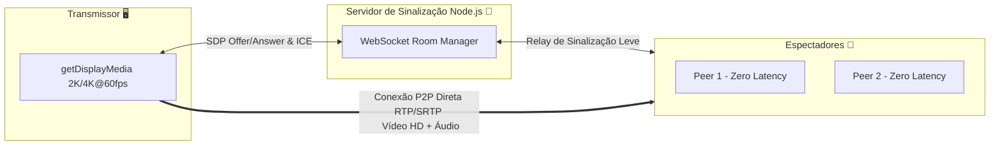

# ⚡ NitroStream HD — P2P Ultra-Low Latency Screen Sharing

<div align="center">


**Uma alternativa moderna, privada e de latência zero ao Discord Nitro para compartilhamento de tela de alta fidelidade via conexões Peer-to-Peer (WebRTC) e WebSockets.**

[Características](#-características-principais) • [Arquitetura](#-como-funciona) • [Guia de Instalação](#-como-rodar-localmente) • [Deploy na Nuvem](#-deploy-na-nuvem-em-1-clique) • [Tecnologias](#-stack-tecnológico)

</div>

---

## 🎯 Sobre o Projeto

O **NitroStream HD** foi desenvolvido para resolver a limitação de paywalls e gargalos de compressão de plataformas tradicionais como o Discord e Google Meet. Utilizando a API nativa do **WebRTC** com negociação SDP otimizada via **WebSockets**, o sistema permite que você compartilhe a tela do seu computador (jogos, programação, lives, apresentações) em **até 4K ou 2K a 60 quadros por segundo reais**, diretamente com seus amigos sem intermediários pesados.

O tráfego de vídeo **não passa por servidores centrais** de streaming — ele flui diretamente de computador para computador (**P2P**), garantindo **0 milissegundos de buffer** e máxima privacidade.

---

## ✨ Características Principais

* 💎 **Resoluções Ultra HD (Sem Paywall):** Suporte total a **4K (2160p)**, **2K / 1440p**, **1080p** e **720p** rodando lisos a **60 FPS** reais.
* 🎯 **Motor Anti-Borrão (Sharpness Engine):** Seletor exclusivo de otimização (`detail` vs `motion` + `scaleResolutionDownBy = 1.0`) que proíbe o navegador de borrar textos, códigos ou elementos gráficos durante o movimento.
* ⛶ **Tela Cheia Real Inteligente:** Ajuste dinâmico do player com suporte a **Esticar 100% (Sem Barras Pretas)**, **Ampliar Zoom (Cover)** ou manter a proporção original.
* 🔗 **Links Mágicos de 1 Clique:** Crie sua sala e gere links diretos (`/?room=X9K3A`). Quem clica entra na transmissão instantaneamente sem precisar digitar senhas ou códigos.
* 🔊 **Amplificador de Áudio P2P:** Sistema integrado com **Web Audio API** permitindo o ganho de volume em até **200%** diretamente na interface do espectador.
* 🛡️ **Conectividade NAT Universal:** Array redundante com 6 servidores STUN e TURN mundiais para conectar através de qualquer roteador ou operadora 4G/5G.
* 💓 **Heartbeat Anti-Queda:** Ping/pong automático via WebSocket de 25 em 25 segundos para impedir que firewalls ou proxies em nuvem derrubem a sala por inatividade.

---

## 🏗️ Como Funciona



O servidor em Node.js atua apenas como um **agente de sinalização** leve. Ele junta os usuários na mesma sala através de um código de 5 caracteres e troca os pacotes de apresentação (SDP e candidatos ICE). Assim que o túnel seguro é estabelecido, o vídeo e o áudio fluem de forma 100% direta entre as máquinas.

---

## 🚀 Como Rodar Localmente

### Pré-requisitos
* [Node.js](https://nodejs.org/) (v18 ou superior)

### Passo a Passo

1. **Clone o repositório:**
   ```bash
   git clone https://github.com/seu-usuario/nitrostream-hd.git
   cd nitrostream-hd
   ```

2. **Instale as dependências:**
   ```bash
   npm install
   ```

3. **Inicie o servidor:**
   ```bash
   npm start
   ```

4. **Acesse no navegador:**
   * **Seu PC (Host):** Abra `http://localhost:3000`
   * **Sua Rede Wi-Fi / LAN:** O console mostrará o seu IP local (ex: `http://192.168.1.15:3000`). Qualquer dispositivo conectado no seu roteador poderá acessar e assistir!

---

## ☁️ Deploy na Nuvem em 1 Clique

O projeto é 100% *stateless* e não precisa de banco de dados. Você pode hospedá-lo gratuitamente:

### Render.com (Recomendado)
O projeto já conta com o arquivo `render.yaml` e `Dockerfile`.
1. Suba este repositório para o seu GitHub.
2. No painel do [Render](https://render.com), crie um novo **Web Service** e conecte seu repositório.
3. O deploy será feito automaticamente e você terá sua URL pública segura (`https://seu-projeto.onrender.com`).

---

## 🛠️ Stack Tecnológico

* **Frontend:** HTML5, Vanilla CSS3 (Glassmorphism Dark UI), Javascript Puro (WebRTC API, Web Audio API, Canvas/MediaStream).
* **Backend:** Node.js, `ws` (WebSockets com Heartbeat e detecção nativa de LAN).
* **DevOps:** Docker, Render Cloud Config.

---

## 📝 Licença

Este projeto está sob a licença [MIT](LICENSE). Sinta-se livre para modificar, distribuir e utilizar em seus projetos!
